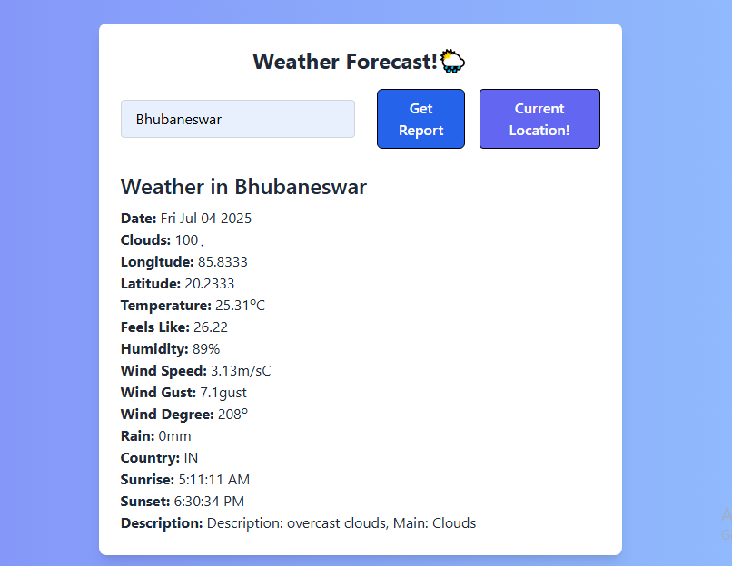

## 🌅 Weather Forecast App:
A simple yet functioning and beautifully moulded weather app, which takes a city name in it's placeholder and gives back the current weather condition of that city using/fetching data from OpenWeatherMap API.

## 📌 Features:

- A placeholder which takes a city by its name and searches for it's weather
- Geolocation API: Fetches weather for the current location using (Geolocation API)
- View temperature, humidity, wind speed, sunrise/sunset, rain, wind(gust,degree), longitude and latitudinal value of the city, coords, feels_like etc
- 5-day weather forecast using OpenWeatherMap which is filtered at 12:00:00 pm everyday, and it flashes the name of the city and date of the current day and also for the next 5 days
- It is responsive for both Mobile and Pc
- Errors are handled properly, and alerts are popuped everytime there is an error.

## 🛠️ Languages and Technologies used:

- HTML5  
- Tailwind CSS  
- JavaScript (Vanilla)  
- OpenWeatherMap API

## 🚀 Setup:
1. Open up the github repository, copy the repository link
2. Clone the repository to your system  
3. Open anyport for your `index.html` to be displayed in any browser  
4. Make sure you to replace the `apiKey` with an actual API_KEY in `script.js` file

## 📸 Screenshots:

*(Optional: add screenshots later if needed)*



## ✅ 4. Push to GitHub:

If your repo is not pushed yet:

```bash
git init(Intializing an empty git repository)
git add .(adding the codes to that repo)
git commit -m "🚀 Completed weather forecast app" (commiting the repo, with a message, suitable/used for version controlling)
git branch -M main(Rename to main branch)
git remote add origin https://github.com/YOUR_USERNAME/YOUR_REPO.git(adding the repo to your pc)
git push -u origin main(pushing the code to the repository to be checked by people in Github)